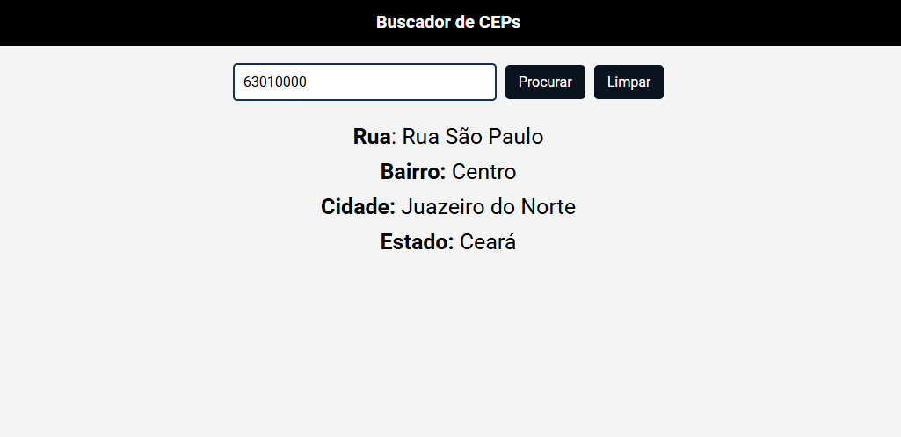

# Projeto Buscador de CEP

Este projeto utiliza uma API pública para buscar CEPs
através de seus números.

## Design do Projeto

### API Utilizada

A API utilizada para este projeto foi: "https://viacep.com.br/", onde ela fornece informações sobre os
CEPs utilizando um JSON como exemplo abaixo:

{
      "cep": "01001-000",
      "logradouro": "Praça da Sé",
      "complemento": "lado ímpar",
      "unidade": "",
      "bairro": "Sé",
      "localidade": "São Paulo",
      "uf": "SP",
      "estado": "São Paulo",
      "regiao": "Sudeste",
      "ibge": "3550308",
      "gia": "1004",
      "ddd": "11",
      "siafi": "7107"
    }

## Funcionalidades do Projeto

- [X] Barra de pesquisa do CEP
- [X] Limpar a pesquisa
- [X] Detalhes do CEP
    - [X] Rua
    - [X] Bairro
    - [X] Cidade
    - [X] Estado
- [X] Responsividade da tela
- [X] Fazer o rodapé
- [X] Melhorar o design

## Contatos

Email: guilhermesilva2022.gs@gmail.com
